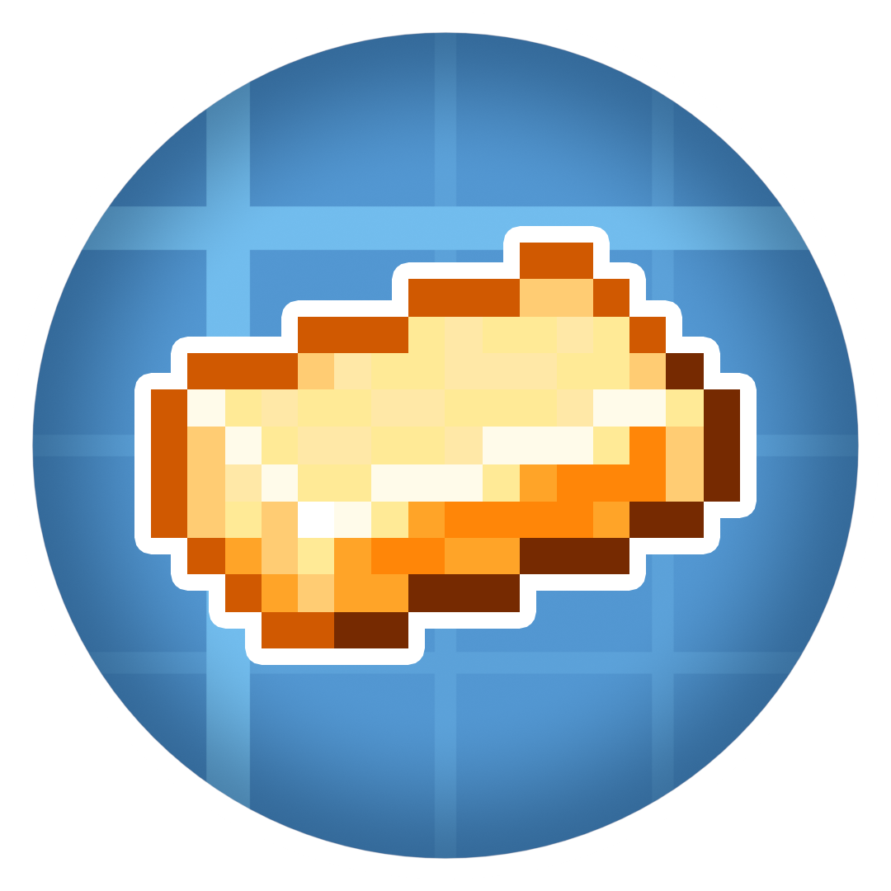

<h1 align="center">Create: Blazing Hot 

</h1>

## 📝 About

This [Create](https://modrinth.com/mod/create-fabric) addon focuses on adding new content related to Nether resources
and existing metals, most notably their liquid forms. Read more about the mod on the [Modrinth](https://modrinth.com/mod/create-blazing-hot) or [Curseforge](https://www.curseforge.com/minecraft/mc-mods/create-blazing-hot) pages.

## ‍👨‍💻 Contributing

* If you find a bug or your game crashes, please submit an issue [here](https://github.com/dudek26/Create-Blazing-Hot/issues).
* Feel free to submit your suggestions on the [issues](https://github.com/dudek26/Create-Blazing-Hot/issues) page.
* If you have some prior modding experience you can try fixing bugs or adding approved features. Make sure to create a [PR](https://github.com/dudek26/Create-Blazing-Hot/pulls) with your changes later!
* You can also help translating the mod. Grab the en_us file, clone the repository, create or edit your chosen localisation file at `common/src/main/resources/assets/blazinghot/lang` and make a [PR](https://github.com/dudek26/Create-Blazing-Hot/pulls) with your changes.
## 📜 License

Create: Blazing Hot is licensed under the MIT license. See [LICENSE](https://github.com/dudek26/Create-Blazing-Hot/blob/1.20.1/LICENSE) for more information.

Certain sections of the code are from the Create mod, which is licensed under the MIT license. See [Create's license](https://github.com/Creators-of-Create/Create/blob/mc1.18/dev/LICENSE) for more information.
